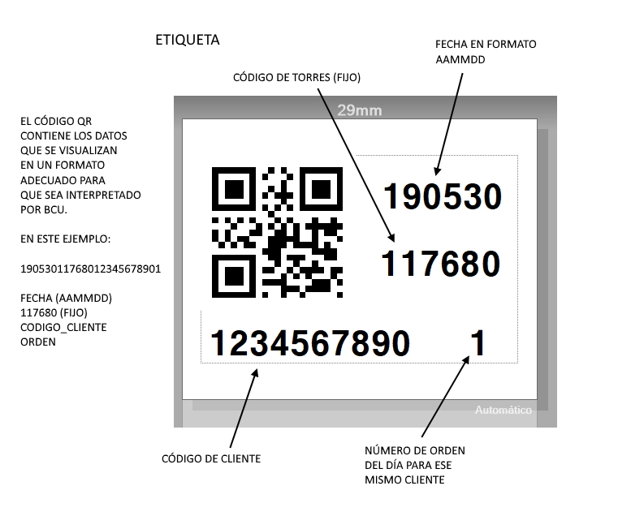

# TRANSPORTES TORRES
# ENVÍO AUTOMÁTICO DE CONFORMES DE ENTREGA

Torres Logística y Transporte (https://ttorres.es/index.php/es/) es proveedor de servicios de Brother Iberia (http://ww.brother.es).

Cada vez que se ejecuta un servicio de transporte, Torres necesita enviar un comprobante de entrega a Brother. Este comprobante de entrega lo recibe Torres en primera instancia en formato papel. El proceso que se venía haciendo era su digitalización y envío por correo electrónico. Pero no se había definido ninguna normalización del documento digital, lo que generaba trabajo adicional a Brother a la hora de recibirlo, renombrarlo, almacenarlo y, en su uso futuro, localizarlo.

Después de analizar las opciones se decide hacer uso de la utilidad Barcode Utility que Brother puede incorporar en sus equipos de digitalizacion junto con otras herramientas para hacer un flujo normalizado y seguro.

El flujo que se decide como necesario es:

1. Torres identifica el documento mediante un código QR
2. Torres digitaliza el documento y lo envía por correo electrónico a Brother
3. Brother recibe el documento digitalizado y lo incorpora a su base documental

## 1 - Torres identifica el documento mediante un código QR

Como los documentos de entrega pueden tener distintos formatos, se decide incorporar un código QR con los siguientes datos:

* Id de Torres. Identificador interno de Torres en los sistemas de Brother
* Fecha en la que se ha producido la entrega
* Id de cliente. Identificador interno de los clientes en los sistemas de Brother
* Número de orden

##### El fichero ImagenEtiqueta.jpg es una muestra documentada de la etiqueta

Este QR se genera automáticamente en una hoja Excel diseñada a tal efecto (BRTorres.xslm). Esta hoja incopora los controles y comandos para que la etiqueta con el QR se imprima en un equipo Brother que tenga la capacidad de usar P-Touch commands

## 2 - Torres digitaliza el documento y lo envía por correo electrónico a Brother

Una vez que un documento está identficado mediante la etiqueta que se genera en el paso anterior, Torres digitaliza el documento mediante la funcionalidad de Escaneado a email que le proporciona un equipo ADS-2800W.

Torres puede almacenar el documento físico en su propio sistema.

## 3 - Brother recibe el documento digitalizado y lo incorpora a su base documental

Se han creado dos cuentas para el servicio:

1. Cuenta de envío desde torres: ece.log.br@gmail.com 
2. Cuenta de recepción en Brother: 

El documento que se envía desde la cuenta de Torres llega a la cuenta de correo electrónico de Brother. Esta cuenta está monitorizada por el servicio Flow de Micorsoft Office 365 que extrae el documento adjunto y lo deposita en una carpeta que está monitorizada por el servicio BCU que se está ejecutando en Brother.

En BCU se han creado las reglas para que el documento que se identifica mediante el código QR pase a formar parte de la base documental en el apartado adecuado. Este repositorio puede ser accedido por el personal de administración de ventas y logísitca autorizado para ello.

